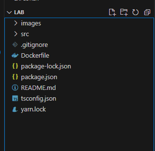
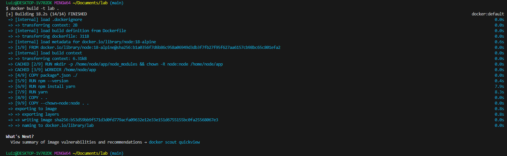

# laboratório

# Passo 1

## Primeiro passo será verificar se você tem as ferramentas necessárias para rodar o programa:

- Fazer download do gitbash no seguinte endereço: https://git-scm.com/download/win
- Fazer download do vscode no seguinte endereço: https://code.visualstudio.com/download
- Fazer download do nodeJS no seguinte endereço: https://nodejs.org/dist/v16.16.0/node-v16.16.0-x64.msi
- Fazer download do docker no seguinte endereço: https://www.docker.com/products/docker-desktop/
- Fazer download do yarn no seguinte endereço: https://classic.yarnpkg.com/lang/en/docs/install/#windows-stable

## Após baixar esses programas iniciais, clone este repositório em sua máquina.

Para clonar o repositório basta abrir o gitbash baixado anteriormente, escolher o diretório de sua preferencia (documents...) e digitar o seguinte comando:
'git clone https://github.com/LuizKischel/lab.git'
Como o repositório é público não necessitará de autenticação.

## Depois de clonar deve abrir o projeto no visual studio code:

Para isto, basta abrir o vscode ir no canto esquerdo em "file" e clicar em open folder, depois é só selecionar a pasta lab clonada localmente.
Você deverá ver algo como isto:



## Fazendo API funcionar:

Agora chegou a hora de validar o funcionamento da api, em seu vscode aperte as teclas **ctrl + "** para abrir o terminal (pode utilizar o powershell ou alterar para o gitbash)

Terminal aberto execute o comando **yarn** para instalar as dependências. Ao finalizar deverá ter gerado uma nova pasta chamada __node_modules__

Exemplo de um comando executado com sucesso:


*Obs: Caso dê algum erro de instalação de pacotes, verifique as versões das ferramentas instaladas.*

Instalação de dependências bem sucedida, podemos rodar a aplicação.
Para rodar a aplicação bastar escrever o comando **yarn start**

Exemplo de api rodando corretamente:


Após exibir a mensagem "Express server has started on port 3333". 
Abra o navegador e acesse o seguinte endereço: http://localhost:3333/health
Deve aparecer a seguinte mensagem:


Para parar de rodar o projeto pode dar um **CTRL + C**

# Passo 2

No segundo passo vamos fazer o build desta aplicação em uma imagem docker para que possamos rodar esta aplicação em um container.

## Build da imagem:

Para buildar a imagem basta estar no terminal e na raiz do projeto e rodar o seguite comando:
COMANDO: "**docker build -t lab .**" 
*OBS: Precisa ter esse espaço e ponto no final do comando*

Exemplo de saida após rodar o comando



Para visualizar a image você pode rodar o comando **docker images**

Após criar a imagem vamos rodar a api como um container; 
Para isto deve se rodar o seguinte comando **docker run -d --publish 8080:3333 lab:latest**

Ao rodar este comando iniciará a execução de um container, para ver o container rode **docker ps**

Para validar a execução da API acesso o seguinte endereço no navegador: http://localhost:8080/health
O retorno deve ser o mesmo "Hello World" visto anteriormente.

Sendo assim garantimos que a aplicação está funcionando perfeitamente via container.

Para parar o container digite **docker ps** e depois **docker stop *id*** sendo que no comando docker ps você irá conseguir ver o id do container.

*OBS: Não se esqueça que o {id} deve ser substituido pelo id do container.*

# Passo 3

## Enviar a imagem para um repositório remoto

Para isto você deve acessar o docker hub: https://hub.docker.com/
Se ainda não tiver, crie uma conta.
Após criar uma conta no docker hub, vá na aba repositories;
Clique em create repository;
E no nome do reposotiry coloque **lab**;
Na opção de visibility em momento inicial vamos deixar como public;
Depois clique em create;
Após criar o repositório, repare que no lado direito terá o comando de como enviar imagem para ele, como na imagem abaixo:


Depois de criar o repositório, taggeie a imagem.
Para isto digite **docker tag lab:latest *nome do seu dockerhub*:1.0**
OBS: É muito importante que o "NOME DO SEU DOCKERHUB" seja substituido pelo nome que aparece no seu dockerhub como na imagem abaixo:


Para validar digite o comando **docker images** 
O no output deverá aparecer a imagem lab e uma nova imagem com o novo nome taggeado.

Depois de taggear a imagem podemos fazer o login para subir a imagem, digite:
**docker login -u *seu usuário* -p *sua senha*** 
É importante substituir os valores em itálico pelos dados usados no momento de criação da conta dockerhub.
O resulto esperado do login é a seguinte mensagem:
**Login Succeeded**

Depois de fazer o login faça o push para seu repositório com o seguinte comando:
**docker push *nome do seu dockerhub*:1.0**

OBS: Novamente não esqueça de substituir o "NOME DO SEU DOCKERHUB" com o mesmo valor que fez acima.

No final do processo você deverá ver sua imagem de versão 1.0 lá no dockerhub.

# Passo 4

## Configurar Kubernetes

Primeiro vamos instalar alguns softwares necessários:
Para instalar o kubectl basta abrir o powershell como administrador e rodar o seguinte comando: **choco install kubernetes-cli**

Se você não tiver o chocolatey instalado poderá baixar no seguinte endereço: https://chocolatey.org/install#individual

Após instalar o kubectl abra o gitbash e digite **kubectl version**

Tendo o kubectl OK, vamos instalar o minikube, é só abrir o powershell e rodar: **choco install minikube**

Quando terminar de instalar, abra o gitbash e digite **minikube start**

Quando o minikube terminar de iniciar rode o comando: **kubectl get pods -n kube-system**

Resultado experado:


OBS: Se este comando não funcionar rode: **kubectl config use-context minikube** mas somente caso o comando acima não funcionar

Kubernetes funcionando podemos começar a montar nosso ambiente. Vamos criar nossa namespace

Digite: **kubectl create namespace lab**

## Criando os manifestos

No gitbash vocês irão criar 2 arquivos, o primeiro será um com o nome deployment.yaml com o código abaixo;
Lembrando que no lugar da imagem *luizkischel/lab:1.0* vocês devem alterar para o nome de vocês no dockerhub;
Este arquivo pode ser criado pelo gitbash com os seguintes comando:

Abra o gitbash e digite: **vim deployment.yaml**
Depois de abrir o vim, copie o código abaixo (já alterando a imagem) e cole no vim. (para colar é shift + insert)
Para sair do vim é só digitar **:wq**

*Caso tenha dificuldades de lidar com o Vim, crie o arquivo pelo visual studio code e faça as demais tarefas pelo terminal no visual studio code.*


```yaml
apiVersion: apps/v1
kind: Deployment
metadata:
  name: lab-deployment
  namespace: lab
  labels:
    app: lab
spec:
  replicas: 1
  selector:
    matchLabels:
      app: lab
  template:
    metadata:
      labels:
        app: lab
    spec:
      containers:
      - name: lab
        image: luizkischel/lab:1.0 (substituir)
        ports:
        - containerPort: 3333
```

Após criar o arquivo digite: **kubectl apply -f deployment.yaml -n lab** 
IMPORTANTE O ARQUIVO ESTAR NO DIRETÓRIO QUE O COMANDO É EXECUTADO, CASO CONTRÁRIO NÃO IRÁ FUNCIONAR.

Depois disso o comando deve exibir: *deployment.apps/lab-deployment created*

Para garantir o funcionamento da sua aplicação digite: **kubectl get pods -n lab**

Deverá aparecer o seu pod.